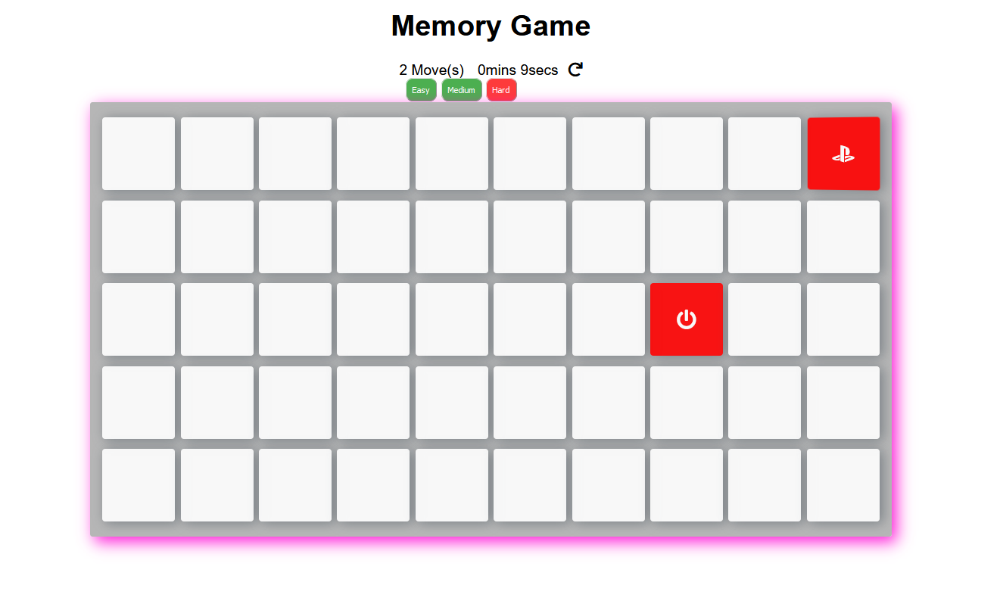
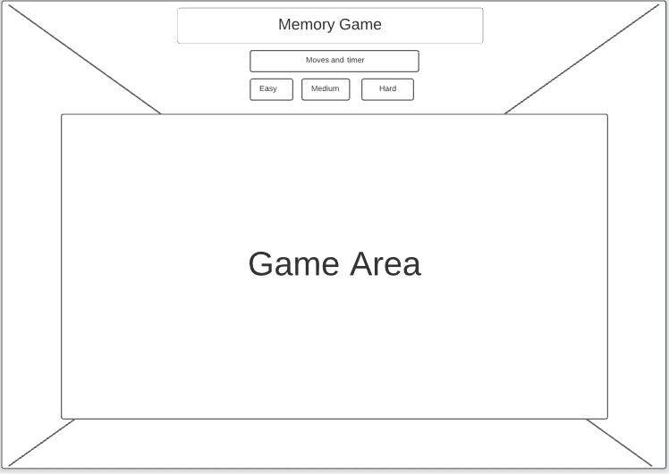

# Milestone Project 2
## Reason For Site
This Website was created for the  purposes of completing the Second Milestone Project for Code Institute's Full Stack Development course. The main purpose of this site is just for alittle fun and games and to test you're memory.

*** 
# User Experience

## User stories

### Goals for First Time Visitors

* As a User For The First Time, I want to easily understand the main purpose of the site.
* As a User For The First Time, I want to be able to understand how to use the site .

### Goals for Returning Visitors

* As a Returning user, I want to see that the main purpose of the site hasn't changed.
* As a Returning user, I want to be able to play as many games on any difficulty without errors.

### Goals for Frequent Visitors

* As a Frequent user, I want to see if there will be any further updates to the game.
* As a Frequent user, I want to see a variety of choices of memory games to play.

***

## Structure

The Page will clearly state what the site is and how to play it:
> * As a User For The First Time, I want to easily understand the main purpose of the site.
> * As a User For The First Time, I want to be able to understand how to use the site .

At the core this is a memory game site so there wont be any major changes to it unless its to add harder levels or different icons :
> * As a Returning user, I want to see that the main purpose of the site hasn't changed.
> * As a Frequent user, I want to see if there will be any further updates to the game.
> * As a Frequent user, I want to see a variety of choices of memory games to play.

This is a one page website for all levels of difficulty, there is a timer, moves counter and reset button to give the player control on how long they are taking and how many moves( just reset the game if you want to try for a faster time).
There is also a choice of 3 levels on this memory game consisting of Easy, Medium and hard.

***
## Website screenshot

***

## Wireframes

Website 

>*This is a 1 page website with the same size game area for each level of difficulty. only one image of a wireframe is needed as this is for desktop and not mobile.

***

## Technologies implemented

* [HTML]
	* This project uses HTML as the main language used to complete the structure of the Website.
* [Bootstrap]
	* The Bootstrap framework is used throughout this website for layouts and styling.
* [CSS]
	* CSS was used for the styling of the elements and colouring.
* [Javascript]
	* JS was used to create the animations of the cards, the shuffling of the cards as well as the timer, move counter and reset button
* [GitHub]
	* GithHub is the hosting site used to store the source code for the Website and [Git Pages](https://pages.github.com/) is used for the deployment of the live site.
* [Git]
	* Git is used as version control software to commit and push code to the GitHub repository where the source code is stored.
* [FireFox Developer Tools]
	* Firefox's built in developer tools are used to inspect page elements and help debug issues with the site layout and test different CSS styles.
***

# Testing

### Test Results

All Pages were run through the [W3C HTML Validator]and showed no errors. 
CSS Stylesheet was run through the [W3C CSS Validator] and showed no errors. 

Test 01 - Test responsiveness of each difficulty website on various screen sizes (excluding tablets and mobiles. This was for different sized laptops and monitors) on Chrome. Website's responsive, no images are distorted and all elements are within the correct sizes.  
Test 02 - Test responsiveness of each difficulty on various screen sizes on (excluding tablets and mobiles. This was for different sized laptops and monitors) Firefox.  Website's responsive, no images are distorted and all elements are within the correct sizes.  
Test 03 - Test responsiveness of each difficulty on various screen sizes on (excluding tablets and mobiles. This was for different sized laptops and monitors) Safari.  Website's responsive, no images are distorted and all elements are within the correct sizes.  
Test 04 - Test responsiveness of each  difficulty on various screen sizes on (excluding tablets and mobiles. This was for different sized laptops and monitors) Edge.  Website's responsive, no images are distorted and all elements are within the correct sizes.  
Test 05 - Test the timer, move counter and restart button again on Chrome, Firefox, safari and Edge.  
Test 06 - Testing that each difficulty takes you to the correct place.  
Test 07 - Easy - Testing that there were exactly 2 of each card (no more or less) and for every match/no match that the appropriate feedback is given 
Test 08 - Easy - Testing that there was no limit to the ammount of moves or timer.
Test 09 - Medium - Testing that there were exactly 2 of each card (no more or less) and for every match/no match that the appropriate feedback is given 
Test 10 - Medium - Testing that there was no limit to the ammount of moves or timer.
Test 11 - Hard - Testing that there were exactly 2 of each card (no more or less) and for every match/no match that the appropriate feedback is given 
Test 12 - Hard - Testing that there was no limit to the ammount of moves or timer.